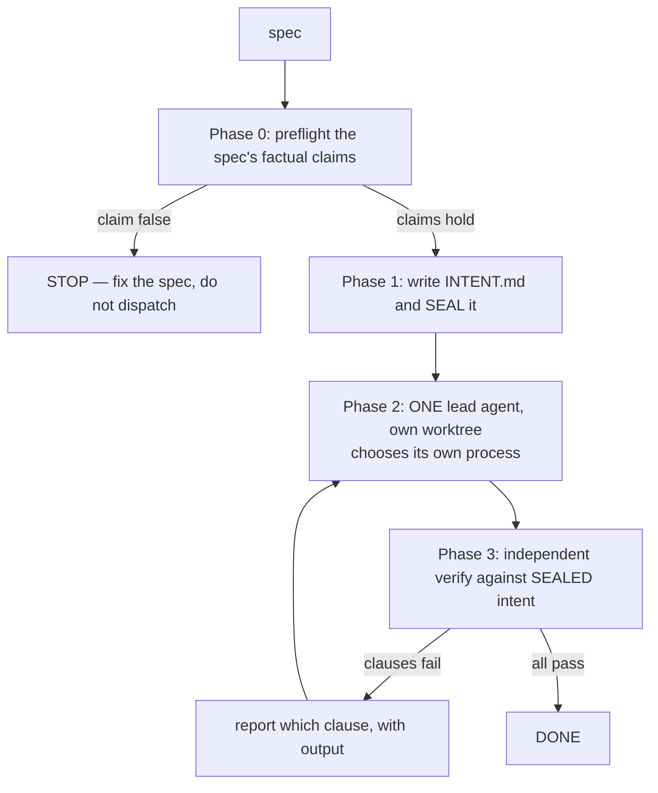

# /solve — delegate the process, constrain the evidence

Built 2026-07-26 from measured failure. `/lifecycle` hard-codes its pipeline
(`3 explorers → planner → 4 plan reviewers → per step: implement → review → refute → fix → verify`)
and has no mechanism to conclude that a small change does not need it. On one three-line `sys.path`
import fix, three scaffolded arms produced nothing and a single agent that was told to *choose its own
process* produced a working fix in 20 minutes:

| arm | agents | wall clock | outcome |
|---|---|---|---|
| `lifecycle-run` baseline | 54 | 79.3 min | STUCK |
| `lifecycle-fix` | 10 | 46.8 min | STUCK |
| `lifecycle-run` + caps/watchdog/probe/preflight | 48 | 67.5 min | ceiling hit, **zero product code** |
| one agent, process delegated | **1** | **20 min** | **working fix** |

Role split in the 48-agent run: **26 review, 14 plan, 5 implement, 2 verify, 1 preflight** — 83%
deliberating, 10% building. Token cost was **99.4% context re-supply** (40M cached prefix re-read
across 853 model turns) against **0.6% generation**.

The lesson is NOT "less structure". The winning prompt was 3,814 characters and more carefully written
than the scaffold. The difference is WHERE the structure sits: **constrain the goal and the evidence,
delegate the process.** Verbatim copy kept at
`/path/to/experiments-repo/experiments/ARM_C_WINNING_PROMPT.md`.



## Phase 0 — preflight the spec (never skip)

The 79-minute STUCK run was dispatched from a spec whose claim "there are none left" was false. The
work was fine; the sentence measuring it was wrong.

```bash
PYTHONPATH=. python3 harness/spec_preflight.py <spec> --strict
```

Exit 0 → dispatch. Exit 2 → **a claim is false; fix the spec, do not dispatch.** Exit 3 → the spec
asserts things but binds no checks; add a ```preflight``` block first.

## Phase 1 — write the INTENT and seal it BEFORE any work

This is the part that makes "verify the intent" safe rather than a loophole. Intent verification is
strictly better than spec-literal verification — the spec was written with less information than the
implementer will end up having — but it is also the perfect excuse for finishing something easier and
declaring THAT the goal. So the intent is registered up front and hashed.

Write `<state-dir>/INTENT.md`, derived from the spec but stating what must actually be **true**, not
what must be typed:

```markdown
# INTENT — <slug>

## I1 — <one line: what must be true when this is done>
verify: <shell command; exit 0 means satisfied>

## I2 — <intent no command can express>
judgement: <why a command cannot decide this>
certified_by:

## I3 — <intent that deliberately departs from the spec>
verify: <cmd>
diverges_from_spec: spec said X; Y is correct instead because <reason>
```

Then seal it:

```bash
PYTHONPATH=. python3 -m harness.intent_contract seal <state-dir>/INTENT.md --spec <spec>
```

Rules the tool enforces, so they cannot be forgotten:
- **Every clause is bound** to a `verify:` command or an explicit `judgement:` rationale. Bound to
  neither → sealing is refused. Silence never reads as a pass.
- **`certified_by:` must be EMPTY at seal time.** It is the one field the seal tolerates being edited
  afterwards, filled by an independent reviewer at Phase 3 — so whoever certifies a judgement clause
  is never whoever sealed it.
- **Divergence is declared, not discovered.** A clause may depart from the spec; it must say so and
  why. An undeclared departure is scope drift wearing an improvement's clothes.
- **Prefer a command to a judgement, always.** A `judgement:` clause costs a reviewer and can be
  argued with; an exit code cannot. If you can think of any command that decides it, use the command.

## Phase 2 — ONE lead agent, and it chooses its own process

Create and **verify** a dedicated worktree first (`isolation: "worktree"` auto-creation is not
reliable — `git worktree add`, then confirm HEAD yourself). Then dispatch a single
`general-purpose` agent on Opus with `mode: "bypassPermissions"` (pre-approved 2026-07-04).

The prompt must contain, and this ordering matters:

1. **The worktree path, and never leave it.** Name the sibling paths it must not touch.
2. **The on-disk files to read first** — the spec, `STATE.md`, `INTENT.md`. Sub-agents are blind to
   memory and CLAUDE.md; anything not named is unavailable.
3. **"How to work — this part is yours to decide."** Verbatim intent: it may do everything itself or
   spawn sub-agents for exploration, review or verification. **"Size the process to the actual change.
   A one-line fix does not need a research phase, a plan review, or four reviewers; a subtle one might
   need more than you'd guess. Deciding that proportion well is the point."**
4. **It may add capability to go faster** — install a library, enable an MCP server or plugin, or
   search the web for an existing tool (including paid ones) that removes work. Buy-vs-build is its
   call to make and to justify. Cheapest correct route wins; reinventing something the repo or the
   ecosystem already provides is a defect, not diligence.
5. **The non-negotiables, all about evidence and none about process:**
   - **RED before GREEN** — reproduce the failure and paste its real output before changing anything.
   - **Root cause in one sentence, with `file:line`.** If it cannot be stated in one sentence it has
     not been found, and making an error message disappear is not fixing it.
   - **"Done" is an exit code, not a claim.** Run every command; paste real output including failures.
   - **Verify independently of the fix.** Whoever wrote the change does not get to be the only voice
     saying it works.
   - **Smallest diff that fully fixes the cause.** Never drop error handling to save lines. No
     "while I'm here" refactors; out-of-scope defects get REPORTED, never fixed.
   - **If the spec is wrong, say so and diverge deliberately** — add the clause to `INTENT.md`
     *before* implementing the divergence, so it is sealed rather than retro-fitted.
6. **A structured return**, framed as *"your text is data for a comparison, not a message to a
   person"*: `root_cause`, `diff_stat`, `intent_clauses` (each PASS/FAIL + the command run),
   `process` (what it did and how many sub-agents it spawned — **0 is a fine answer**),
   `verified_by`, `capability_added`, `out_of_scope_found`, `commit`.

## Phase 3 — verify against the sealed intent

Run the contract. This is a real command with a real exit code, not a reading:

```bash
PYTHONPATH=. python3 -m harness.intent_contract verify <state-dir>/INTENT.md --cwd <worktree>
```

| exit | meaning | what to do |
|---|---|---|
| 0 | every clause satisfied | DONE |
| 1 | a bound command failed, or a judgement clause is uncertified | report the named clause + its output back to Phase 2 |
| 2 | malformed intent file | fix the file |
| 3 | never sealed | **stop** — there is no pre-registered intent, so any verdict is written after the fact |
| 4 | intent changed after sealing | **stop and investigate.** The target moved after the shot. |

Judgement clauses are certified by a **fresh read-only reviewer** that never saw the implementation
conversation — it fills `certified_by:`. The lead agent may not certify its own judgement clauses.

## When NOT to use this

- **A spec with genuine human gates** (design pick, blast-radius approval) → `/spec-queue`, which
  knows how to park and continue.
- **A queue of specs** → `/spec-queue`; this skill deliberately does one.
- **Load-bearing engine changes to the solver or the moat** → keep `/lifecycle`'s full review
  fan-out. The 83/10 ratio is waste on a three-line import fix and cheap insurance on
  `confident_wrong`. Judgement about which is which is the entire point of this skill; do not spend
  it to save four reviewers on the moat.

## Guardrails that still apply

- **`confident_wrong` must never rise.** `scripts/invariant_check.py` stays green.
- **NEVER edit** secrets/`.env`, `reports/golden_witness.json`, or live weights
  (`reports/model_c.pt`, `runs/model_a`, `runs/model_b`).
- **Engine/extraction code stays on GitLab**, never GitHub, and never goes to a third-party
  inference provider. A lead agent adding an MCP or a paid tool must respect that boundary —
  command output is safe to send; solver source is not.
- `harness/done_gate.py` remains the turn-end backstop. This skill does not replace it.
