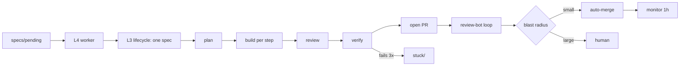
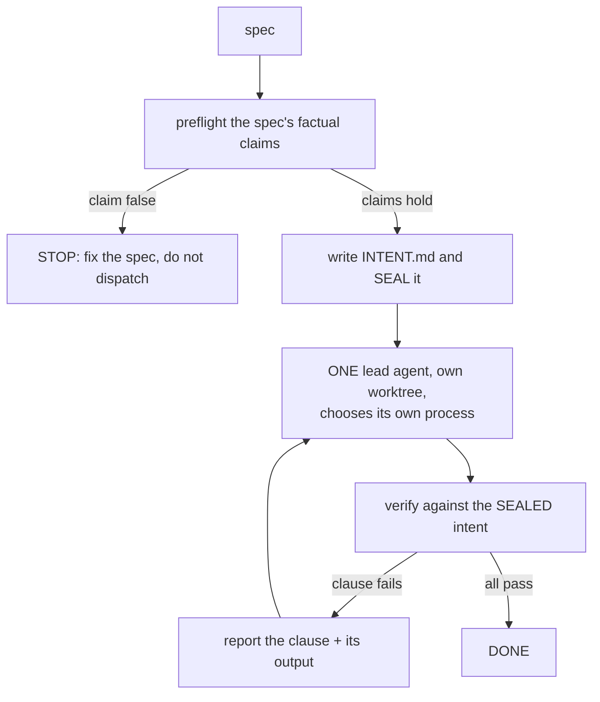

# Three attempts at a loop that codes without us

> Prepared for **Ray** (Loopy AI / Agentic Coding School) · 2026-07-26
> Authors: Michael + Claude Opus 5 · Every number below comes from run transcripts, not recollection.

We built your L3/L4 design, measured it against a control, and **it lost badly to a single agent.**
This is what we tried, what the instruments said, and where we have knowingly walked away from the
course — including one divergence we are not confident about.

---

## What we are asking you

Four questions. Everything after this section is the evidence behind them.

1. **Does the L3 lifecycle have a mechanism to size its process to the change?**
   We could not find one, and this turned out to be the whole problem. Our L3 runs the full pipeline
   on a three-line import fix and on a schema migration alike.

2. **Is the multi-angle review meant to run per-step, or once per plan?**
   We ran four persona lenses on every step's diff, on every attempt. On one run that was 26 of 48
   sub-agents. We have since moved the lenses to the plan and kept only correctness, reuse and an
   outside model on the diff — but we are guessing at your intent.

3. **Is there a pattern for sharing context across sub-agents?**
   Our newest measurement says **99.4% of token spend is cached-prefix re-supply, not generation.**
   Every fresh-context sub-agent re-reads a 24–43k prefix on every turn of its tool loop. Fresh
   context is the *point* of the design, so we assume this is a known cost with a known mitigation
   we have missed.

4. **How do you run sub-agents unattended without permission prompts?**
   An unattended worker cannot stop for an ask-tier prompt, so ours spawn with `bypassPermissions`.
   Anthropic's own guidance says never to do this. We think we are wrong here and have not fixed it.

**What we are not asking:** whether the course works. The L3/L4 skeleton is the reason we have a
queue, a blast-radius gate and a review-bot fix loop at all. We are asking where our *adaptation*
went wrong, because we changed a lot and only measured afterwards.

---

## Attempt 1 — our own orchestrator
*before 2026-07-25 · retired*

A single `/orchestrator` skill. Ad-hoc intake from arguments, one planner sub-agent producing steps
that each carried an exit-0 `verify` command, one adversarial reviewer, and a deterministic `Stop`
hook that refused to let a turn end while any contract requirement lacked a passing test.

**Why we moved off it**

- **No queue.** Every task needed a human to start it. No way to leave work running overnight.
- **One reviewer.** A single adversarial pass missed whole classes of defect — most notably reuse:
  five reviewers hunting bugs are all blind to *"this hand-rolls something the repo already
  provides."*
- **Nothing after the PR.** No review-bot loop, no merge gate, no post-merge monitoring. The loop
  stopped exactly where the risk starts.
- **No user-flow verification.** A screenshot rule, not a loop.

Every item on that list is something your L3/L4 design already had, which is why we adopted it
rather than patching ours.

---

## Attempt 2 — your L3/L4 skeleton, with our floors grafted in
*2026-07-25 · `/lifecycle` + `/spec-queue`*

We wrote an explicit adopt-versus-keep decision for every aspect **before** building, so the
divergences are deliberate rather than drift. Abbreviated:

| Aspect | Ours (attempt 1) | Course L3/L4 | Decision |
|---|---|---|---|
| Intake | ad-hoc arguments | interview → spec file → queue folder | **Course** |
| Review | one adversarial reviewer | multi-angle + per-finding verify agents | **Course** |
| Second model | none | Codex alongside | *Adapted* — a PR review bot is our second voice |
| User-flow verify | screenshot rule | dedicated L2 loop, GIF per flow | **Course** |
| Merge gate | human always | blast-radius agent, small→auto | *Course + hardened* — protected paths always human |
| Post-merge | none | monitor logs 1h → hotfix loop | **Course** |
| Queueing | none | L4 worker drains queue | **Course** |
| Tools-first research gate | mandatory phase | absent | **Kept ours** |
| Done discipline | exit-0 per step + Stop-hook backstop | agent judgement | **Kept ours** |
| Model matching per step | haiku/sonnet/opus | not addressed | **Kept ours** |
| GUI / design gates | design tokens + live screenshot | not addressed | **Kept ours, strengthened** |

The one we would defend hardest is **done discipline**. This harness exists because work kept getting
reported finished when it wasn't, so "done" is an exit code here, never a claim, and a `Stop` hook
enforces it deterministically at turn-end. Agent judgement was the thing that failed us.



---

## The day we finally measured it
*2026-07-26 — the control beat the loop*

Same trivial bug to four configurations: a Python CLI that crashed with `ImportError` when run as a
script. The fix is three lines. Each ran in its own git worktree, on Opus, from the same spec.

| Arm | Sub-agents | Output tokens | Wall clock | Outcome |
|---|---|---|---|---|
| L3 `lifecycle-run`, baseline | 54 | 342k | 79.3 min | **STUCK** |
| L3 `lifecycle-fix`, small-bug variant | 10 | 83k | 46.8 min | **STUCK** |
| L3 + caps, watchdog, cheap-probe, preflight | 48 | 237k | 67.5 min | **ceiling hit — zero product code** |
| **One agent, told to choose its own process** | **1** | **8k** | **20 min** | **working fix** |

### Where the 48 agents went

Roles inferred from each agent's own opening prompt:

| Role | Agents | Share |
|---|---|---|
| review | 26 | 54% |
| plan | 14 | 29% |
| **implement** — *the only ones that change code* | **5** | **10%** |
| verify | 2 | 4% |
| preflight | 1 | 2% |

> **83% of the fleet deliberated. 10% built.** On a three-line import fix. Several review agents
> re-read a 24–43k prefix in order to emit 300 tokens.

### Two other readings that surprised us

Time and cost point in **opposite** directions. We had been quoting the first as if it explained the
second:

| Bottleneck | Measurement | Implied lever |
|---|---|---|
| wall clock | 87.5% model generation / 12.1% tool exec | concurrency, fewer serial stages |
| token cost | 99.4% context re-supply / 0.6% generation | smaller prefix, fewer turns per agent |

Cost decomposes as `agents × turns-per-agent × prefix-size` — measured at `40 × 21.3 × 46,880`. We
had built a sub-agent cap, which attacks only the first and weakest multiplier. Cache read accrues
per API call, so every turn of an agent's tool loop re-reads its whole prefix.

Separately, **concurrency was idling at 1.67×**, and one baseline run lost **27.7% of its wall clock —
40.4 agent-minutes across 52 gaps** — to agents that produced nothing and then finished the same work
in minutes on respawn.

### The finding that embarrassed us most

While measuring, we discovered **554 tests had silently not been running.** Three files in the test
directory were one-shot scripts whose module-level code called `sys.exit(1)`; pytest imports every
file during collection, so any one of them aborted collection for the entire directory with
`INTERNALERROR — no tests ran`. It read as an infrastructure problem rather than a testing gap.

That is a false green sitting inside the very mechanism built to prevent false greens, and nothing in
the loop noticed for an unknown period. Guard: `harness/tests/test_tests_are_collectable_20260726.py`.

---

## What we changed, and what we concluded

We first assumed the problem was **spend**, and built four levers accordingly. They worked: agents
54 → 40, output 342k → 237k, wall clock 79 → 52 min. The run still finished with **zero product-code
changes.**

- **A hard sub-agent ceiling.** There had been none of any kind; an earlier run reached 77 agents in
  1h42m.
- **A watchdog on silent agents.** Six-minute bell, one respawn, longer leash on the retry.
- **A cheap probe before expensive review.** Run the step's own verify command first, fan out
  reviewers only if it passes. *"A thermometer, not a doctor."*
- **A spec preflight.** Specs carry executable claims; a spec whose factual claim is false refuses to
  dispatch. Built after a run spent 79 minutes failing to satisfy a spec sentence that was wrong.
- **A ceiling that degrades instead of detonating.** Our first cap *threw*, discarding the finished
  plan, five implementer attempts and 26 completed reviews. It now emits what it learned on the way
  out.

Then we read the winning arm's prompt again, and the conclusion changed. It is **3,814 characters** —
longer and more carefully written than we remembered. It is *not* "less scaffolding."

```
## How to work — this part is yours to decide

You choose your own process. You may do it all yourself, or spawn
sub-agents for whatever you judge worth delegating. **Size the process
to the actual change.** A one-line fix does not need a research phase,
a plan review, or four reviewers; a subtle one might need more than
you'd guess. Deciding that proportion well is the point.
```

Every one of its six non-negotiables is about **evidence**, never process: red before green; root
cause in one sentence with `file:line`; done is an exit code; verify independently of the fix;
smallest diff that fully fixes the cause; report out-of-scope findings rather than fixing them.

> **Constrain the goal and the evidence. Delegate the process.** Our L3 does the opposite — its phase
> list is hard-coded and it has no way to decide a small change doesn't need all of it.

Full prompt: [`ARM_C_WINNING_PROMPT.md`](ARM_C_WINNING_PROMPT.md).

---

## Attempt 3 — where we are now

A third loop, [`/solve`](../.claude/skills/solve/SKILL.md), sits *alongside* `/lifecycle` rather than
replacing it. One lead agent picks its own process; verification moved from the spec's literal clauses
to a **sealed statement of intent**.



The reasoning for intent over spec-clauses: real implementers routinely find the spec was written
with less information than they end up having. A spec clause that is *itself the defect* currently
makes our loop fail rather than say so.

But "verify the intent" is also perfect cover for finishing something easier and declaring *that* the
goal — the exact overclaiming this harness exists to stop. So intent verification is made **harder**
to fudge than spec verification, by four rules a tool enforces rather than a prompt requests
([`harness/intent_contract.py`](../harness/intent_contract.py)):

- **Sealed before the work.** The intent is hashed up front. Editing it afterwards is exit code 4,
  not a pass. You cannot move the target after taking the shot.
- **Every clause binds a command**, or states explicitly why none can. Bound to neither, sealing is
  refused — silence never reads as a pass.
- **Judgement clauses cannot self-certify.** `certified_by` must be empty at seal time; it is the
  only field the seal tolerates being edited later, and it is filled by a reviewer that never saw
  the implementation.
- **Divergence is declared, not discovered.** A clause may depart from the spec, but must record what
  the spec said and why this is better. An undeclared departure is scope drift wearing an
  improvement's clothes.

We also kept an explicit carve-out: load-bearing changes keep the **full** review fan-out. The 83/10
deliberation ratio is waste on an import fix and cheap insurance on a metric that must never regress
(see the README's note on that metric). Knowing which is which is the judgement the whole design now
rests on.

---

## Divergences we are least confident about

In rough order of how much we would like to be corrected.

1. **Sub-agents spawn with `bypassPermissions`.** Anthropic's guidance says never to skip
   permissions. An unattended L4 worker cannot stop for an ask-tier prompt, so we did it anyway, on a
   standing pre-approval. Hard hook denials still apply and a `PreToolUse` guard blocks secrets and
   destructive commands. We suspect there is a correct pattern here we have simply not found, and we
   have been sitting on this rather than resolving it.

2. **We replaced four per-diff persona lenses with three** — correctness, reuse, and an outside
   model. The persona rationale is *context focus*, and we reasoned that is spent once on the plan
   rather than per diff, a step's diff being small enough for one reviewer to hold entirely. This may
   simply be us weakening review to save agents.

3. **Plan review is gated to plans of three or more steps.** Your own scope note says the pattern is
   not for tiny changes where hook overhead dominates, so we think this is in the spirit of the
   course — but it is the change we made with the least evidence.

4. **A PR review bot stands in for a second-model review.** We do not run Codex. The bot reviews the
   pull request, which means our independent second opinion arrives *after* the PR is open rather
   than beside the build. We do not know if that ordering costs us anything.

---

## How we are keeping ourselves honest from here

Every claim above is now a registered hypothesis with a written falsifier
([`BELIEFS.md`](BELIEFS.md)), so a belief cannot quietly become an assumption. Fourteen are open. The
measurement harness computes agent counts and token spend from run transcripts rather than accepting
typed numbers, because we got two of today's figures wrong by reading a mid-run snapshot and a
working tree instead of a passing verify.

The one thing we will not do again is tune before measuring. We spent a day building levers for a
problem — spend — that turned out not to be the one making the loop fail.

---

*Happy to share any run transcript or the four arm prompts. The application code stays private; none
of the loop scaffolding does.*
